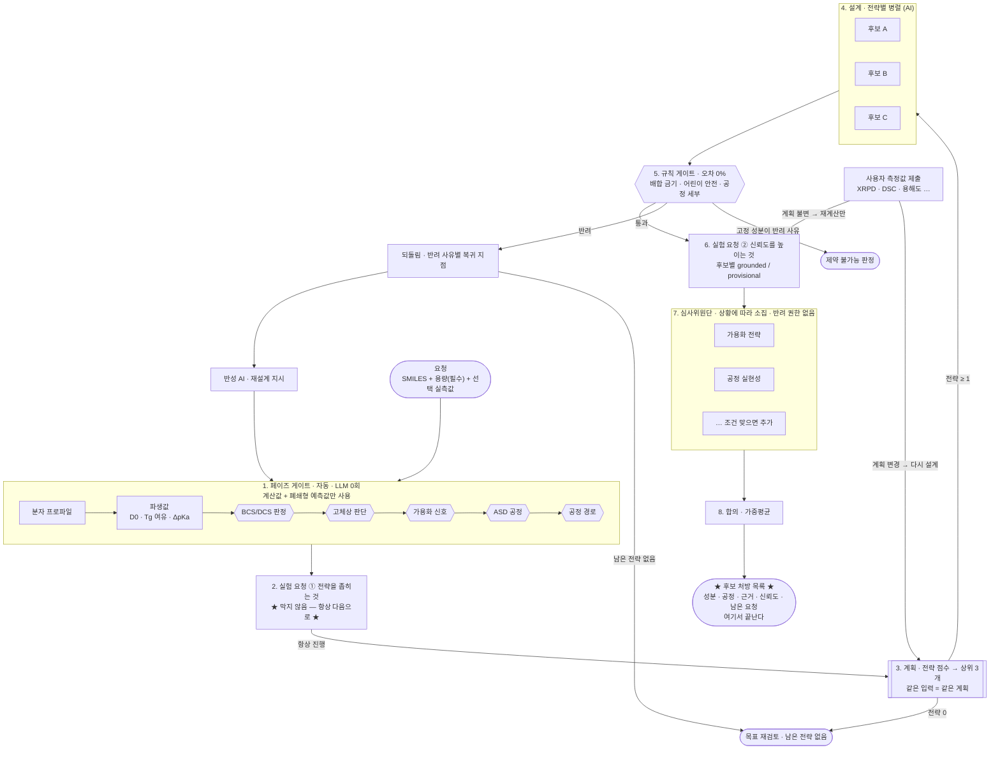

# Formula 1 — 실패를 미리 겪어보는 AI 제형 설계 시스템

> 약을 실제로 만들어 보기 전에, 여러 AI가 서로 견제하며 "이 처방은 왜 실패할지"를 미리 찾아내고, 모르는 것은 모른다고 말하며 **어떤 실험이 필요한지 스스로 묻는** 시스템입니다.
>
> 제4회 인공지능 신약개발 경진대회 출품작 · 팀 **Formula 1**

**바로 써 보기 → <https://zihwan.com/f>** (라이브 서버는 아직 v1 구현입니다 — [14장](#14-현재-상태와-남은-일) 참고)

---

## 한눈에 보기

분자식(SMILES)과 용량만 넣으면 됩니다. 컴퓨터가 분자에서 계산할 수 있는 값은 **전부 자동으로 계산**하고, 출처가 붙은 규칙표들이 정해진 순서대로 "어떤 제형 전략이 맞는가"를 좁힙니다. 그 전략별로 AI가 처방 후보를 만들고, 규칙이 금기를 검사하고, 상황에 맞게 불려 온 AI 심사관이 순위를 매깁니다.

이 버전(v3)의 중심은 **lab-in-the-loop**입니다. 계산만으로는 알 수 없고 실험을 해야 알 수 있는 값이 판정을 가르는 지점에 오면, 시스템이 **XRPD·DSC·TGA·평형용해도 같은 구체적인 시험**을 사용자에게 요청합니다. 이 요청은 **실행을 막지 않습니다.** 지금 가진 정보로 후보를 먼저 내고, 측정값이 들어오면 후보를 좁힙니다.

최종 산출물은 **후보 처방 목록**입니다 — 성분·공정 단계·판정 근거·신뢰도 태그(`grounded`/`provisional`)·아직 풀리지 않은 데이터 요청까지. 실행 프로토콜·포장 사양·승인 절차·배치 제조 이후는 이 시스템이 다루지 않습니다.

이 전 과정이 웹 화면에서 실시간으로 보이고, **API 키 없이도 전부 동작합니다.**

## 목차

1. [무엇이 문제인가](#1-무엇이-문제인가)
2. [챗봇에게 맡기면 안 되는 이유](#2-챗봇에게-맡기면-안-되는-이유)
3. [핵심 아이디어 — 창의는 AI가, 검증은 규칙이](#3-핵심-아이디어--창의는-ai가-검증은-규칙이)
4. [전체 흐름 — 어디서 시작해 어디서 끝나는가](#4-전체-흐름--어디서-시작해-어디서-끝나는가)
5. [값의 세 계층 — 계산값 · 예측값 · 실측값](#5-값의-세-계층--계산값--예측값--실측값)
6. [입구 — 분자 구조부터 계산한다](#6-입구--분자-구조부터-계산한다)
7. [검사에는 순서가 있다](#7-검사에는-순서가-있다)
8. [실험 요청 — 무엇을, 언제, 왜 묻는가](#8-실험-요청--무엇을-언제-왜-묻는가)
9. [실제로 이렇게 돕니다 (시연 시나리오 3개)](#9-실제로-이렇게-돕니다)
10. [우리가 쓴 룰북](#10-우리가-쓴-룰북)
11. [이 시스템의 차별점](#11-이-시스템의-차별점)
12. [기술 구조](#12-기술-구조-개발자용)
13. [직접 실행해 보기](#13-직접-실행해-보기)
14. [현재 상태와 남은 일](#14-현재-상태와-남은-일)

---

## 1. 무엇이 문제인가

새로운 약 하나를 세상에 내놓기까지 보통 10년이 넘게, 수조 원이 듭니다. 그런데 이 과정이 "약효 성분을 찾는 일"로 끝나지 않습니다. 약효를 내는 주성분을 찾았더라도 사람이 삼킬 수 있는 형태 — 알약, 캡슐, 시럽 — 로 만들어야 비로소 약이 됩니다. 이 단계를 **제형 설계**라고 부릅니다.

문제는 주성분 하나로는 알약이 굳지 않고, 잘 녹지도 않는 경우가 많다는 점입니다. 그래서 여러 첨가제를 섞고 녹이는 전략을 고르는데, 바로 그 선택에서 사고가 납니다.

| 사고 유형 | 무슨 일이 생기나 |
|---|---|
| 화학적 충돌 | 주성분과 첨가제가 반응해 약이 갈색으로 변하거나 분해된다 |
| 전략 오판 | 녹는 속도가 문제인 약에 녹는 양을 올리는 비싼 공정을 쓰거나, 그 반대를 한다 |
| 공정 실패 | 가루를 눌러 알약으로 찍을 때 부서지거나 기계에 들러붙는다 |
| 규제 초과 | 나라마다 정한 첨가제 상한을 넘긴다. 어린이용은 기준이 훨씬 엄격하다 |

지금까지 제약 현장은 이걸 **실험실에서 직접 만들어 보고, 실패하면 다시 설계하는** 방식으로 풀었습니다. 한 번 실험에 드는 시간과 비용이 크고, 그 시행착오를 수십 번 반복합니다. 이 시행착오를 **컴퓨터 안에서 최대한 미리 끝내고, 꼭 필요한 실험만 골라 요청하자**는 것이 이 프로젝트의 출발점입니다.

## 2. 챗봇에게 맡기면 안 되는 이유

"AI가 똑똑하니 좋은 처방을 물어보면 되지 않나?" 여기에 함정이 있습니다.

거대언어모델은 말을 아주 그럴듯하게 합니다. 그런데 그럴듯한 것과 실제로 맞는 것은 다릅니다. 이런 AI는 **없는 사실을 자신 있게 지어내는 일(환각)** 이 있습니다. 일어나지 않는 화학 반응을 매끄럽게 설명하고, 만들 수 없는 처방을 태연히 제시하며, 녹는점이나 용해도 같은 물성값까지 지어냅니다.

제약에서 이런 실수는 곧 제품 폐기와 허가 반려입니다. 그래서 이 분야에는 "그럴듯함"이 아니라 **"확실히 맞음"**, 그리고 확실하지 않을 때는 **"모른다"고 말하는 정직함**이 필요합니다.

## 3. 핵심 아이디어 — 창의는 AI가, 검증은 규칙이

그래서 역할을 나눴습니다.

> **새로운 처방을 상상하고 만드는 일은 AI에게,
> 그것이 맞는지 검사하는 일은 절대 틀리지 않는 규칙에게,
> 규칙이 판단할 값이 없을 때는 실험에게 맡긴다.**

첨가제와 공정 조건의 조합은 사실상 천문학적입니다. 이 넓은 공간에서 쓸 만한 후보를 상상하고, 서로 부딪히는 목표 사이에서 타협점을 찾는 일은 AI가 잘합니다. 반대로 "이 첨가제가 어린이 상한을 넘는가" 같은 판단은 계산기처럼 언제나 똑같이 내려야 합니다.

| 성격 | 예시 | 담당 |
|---|---|---|
| 숫자로 답이 떨어지는 것 | "이 첨가제가 10mg 이하인가" | 규칙 기반 검사기 (계산) |
| 맥락을 읽어야 하는 것 | "이 조합이 어린이가 먹기에 자연스러운가" | 심사 AI (판단) |
| 계산으로 알 수 없는 것 | "이 약의 실제 용해도는 얼마인가" | 사용자의 실험 (측정) |

권한도 셋으로 나뉩니다. **반려는 룰북만**, **후보의 신뢰도 태그는 데이터 요청 계층만**, **심사관은 순위만** 정할 수 있습니다.

## 4. 전체 흐름 — 어디서 시작해 어디서 끝나는가

가장 큰 특징은 **AI 구성이 고정돼 있지 않다**는 점입니다. 요청이 들어올 때마다 그 상황에 필요한 전략과 전문가를 그때그때 골라 팀을 새로 꾸립니다. 그리고 그 선택 자체는 AI가 아니라 **규칙표가 결정론적으로** 합니다 — 같은 입력이면 같은 계획이 나오고, 그 계획 자체가 감사 기록이 됩니다.



**페이즈 게이트**는 분자에서 계산한 값과 간단한 경험식 예측으로 "이 약에 어떤 전략이 맞는가"를 판정합니다. 여기에는 AI가 없습니다.

**실험 요청**은 두 번 나옵니다. 계획을 세우기 전에는 *전략 선택 자체를 바꿀 수 있는 값*을, 후보가 나온 뒤에는 *그 후보의 신뢰도를 올릴 값*을 묻습니다. 어느 쪽도 흐름을 멈추지 않습니다.

**설계 계층**은 초안을 하나만 만들지 않습니다. 계획이 고른 전략(최대 3개)마다 후보를 동시에 만들어 경쟁시킵니다.

**규칙 게이트**만 후보를 반려할 수 있습니다. 반려되면 사유에 따라 **어느 단계로 되돌아갈지**가 규칙표(`backtrack_transitions.csv`)에 정해져 있습니다 — 첨가제 문제면 성분만 바꾸고, 공정 문제면 공정 경로부터, 전략 문제면 전략 선택부터 다시 합니다.

**심사위원단**은 맥락을 읽어야 하는 부분을 담당하되 **반려 권한이 없습니다** — 점수는 통과한 후보들 사이의 순위 결정에만 씁니다.

### 이 시스템은 후보 처방에서 끝납니다

| 산출물에 포함 | 산출물에서 제외 |
|---|---|
| 성분 목록(역할 · 비율) | 포장 사양(용기 · 차단성) |
| 전략 가족(예: 분무건조 ASD → 건식과립 → 타정) | 공정 파라미터를 명시한 실행 프로토콜 |
| 공정 단계 목록 | 실험계획법(DoE) 설계공간 · 위험평가 |
| 판정 근거(어느 규칙이 왜 통과/반려했는지) | 용출 시험법 · 생체등가성 전략 |
| 신뢰도 태그(`grounded` / `provisional`) | 승인 · 서명 절차 |
| 남은 실험 요청 목록 | 배치 제조 결과와 그 이후의 되먹임 |

처방이 실행되지 않으면 안정성 시험도, 포장도, 배치 결과도 대상이 없습니다. 그래서 그 단계들은 입력 자체를 갖지 못하고, 이 빌드에서는 **배선하지 않았습니다**([14장](#14-현재-상태와-남은-일)).

### 심사관은 고정 명단이 없습니다

명단에 일곱 명이 등록돼 있고, 조건이 맞는 사람만 그 자리에서 만들어집니다.

| 심사관 | 소집 조건 |
|---|---|
| 어린이 안전 | 대상이 어린이일 때 |
| 가용화 전략 | 가용화·미분화 후보가 생겼거나, 실측 BCS가 II/IV일 때 |
| 공정 실현성 | 항상 |
| 규제 취지 | 숫자로 못 끊은 규제 판단이 남았을 때 |
| 문헌 조사 | 룰북이 모르는 성분이 있거나, 룰북이 다루지 않는 전략(ASD·용융압출·사이클로덱스트린)이 후보일 때 |
| 고령자 안전 | 대상이 고령자일 때 |
| **고체상 안정성** (신규) | ASD 후보가 있거나, 염/공결정 경계 구간이거나, 염 안정성 주의가 켜졌을 때 |

어린이용 요청에서는 어린이 안전 심사관이 들어오고 고령자 심사관은 **아예 만들어지지 않습니다.** 요청을 고령자용으로 바꾸면 반대가 됩니다.

## 5. 값의 세 계층 — 계산값 · 예측값 · 실측값

이 버전의 중심 설계입니다. 제형 판단에 쓰이는 모든 값을 **어떻게 얻었는가**로 세 계층으로 나눕니다.

| 계층 | 정의 | 예시 | 신뢰 |
|---|---|---|---|
| **A. 계산값** | 분자식에서 결정론적으로 나온다 | 분자량 · cLogP · 극성표면적 · 회전가능결합 · 수소결합 주개/받개 · 구조 패턴 | 확정 |
| **B. 예측값** | 계산값에 간단한 경험식을 적용해 추정한다 | ESOL(Delaney 2004) · GSE(Jain & Yalkowsky 2001) 용해도 · ⅔ 경험칙 Tg | 잠정 — `*_est`·`*_provisional` 변수에만 저장 |
| **C. 실측값** | 실험을 해야만 나온다 | XRPD · DSC · TGA · 수분 · pKa · 평형용해도 · 투과도 · 강제분해 | 확정(측정 후) |

**A는 항상 자동으로 계산합니다.** 사용자에게 묻지 않습니다.
**C가 판정을 가르는 지점에서만 요청합니다.** 이 요청이 lab-in-the-loop의 실체입니다.

### 예측값은 실측값을 덮지 않고, 실측값은 예측값을 지우지 않습니다

예측 용해도(`solubility_est_mg_per_ml`)와 실측 용해도(`solubility_mg_per_ml`)는 **서로 다른 변수**입니다. 실측이 들어와도 예측값은 남아서, "이 계열 화합물에서는 예측이 몇 배 낮게 나왔다"는 보정 정보가 됩니다. 반대로 BCS 등급(`bcs_class`)은 **실측값으로만** 확정합니다. 예측으로는 "잠정 저용해도"까지만 말하고, 그것은 전략 탐색 범위를 넓히는 데만 씁니다.

### 무거운 예측 모델 대신 실측을 요청합니다

신경망 기반 예측기(SolTranNet · ADMET-AI · QupKake)는 기본 구성에서 뺐습니다. 예측 계층은 **RDKit 계산값 + 공개된 경험식만으로** 성립합니다.

경험식이 계산되지 않거나(녹는점을 몰라 GSE를 못 쓸 때) 두 예측이 서로 크게 어긋나면, 더 무거운 모델로 빈칸을 메우지 않고 **"여기서부터는 모른다"고 말하고 측정을 요청합니다.** 검증되지 않은 예측값으로 조용히 메꾸는 것보다 그편이 근거 있는 결과를 만듭니다. 외부 예측기는 설치되어 있으면 추가 후보로 참여시킬 수 있는 **선택적 보강**으로만 남겨 둡니다.

### 파생값도 코드가 아니라 데이터입니다

D0(용량/용해도 비) · 흡수 한계 · Tg 여유 · ΔpKa · 보수적 예측 용해도 같은 파생값은 전부 `derived_quantities.csv`(23행)에 **식으로** 적혀 있습니다. 개발 중 "보수적 logS"를 파이썬에서 미리 계산하게 짰더니, 그 재료(ESOL·GSE)가 아직 계산되기 전이라 값이 늘 비었고 — 아무 실측도 없는 상태에서 **전략이 하나도 생성되지 않는** 오류가 실제로 났습니다. 이 값을 표의 한 행으로 옮기자 순서 문제가 사라졌습니다. "파생값은 데이터"라는 원칙을 어기는 순간 생기는 사고입니다.

## 6. 입구 — 분자 구조부터 계산한다

필수 입력은 **분자식(SMILES)과 용량** 두 가지입니다. 나머지(대상 환자 · 제형 · 이미 가진 실측값)는 선택입니다. 비어 있으면 예측하거나 "모름"으로 두고 진행합니다.

```
분자식 (SMILES)
   │
   ├─ 1. 구조 품질 검사    파싱·염·전하·입체중심이 온전한가
   ├─ 2. 분자 특성값 계산   35종 (분자량 · 극성표면적 · 수소결합 밀도 …)
   ├─ 3. 구조 패턴 검출     82종 (아민 · 가수분해 · 산화 · 광분해 …)
   ├─ 4. 폐쇄형 예측        ESOL · GSE 용해도, ⅔ 경험칙 Tg
   └─ 5. 문헌 조사         PubChem 식별정보 + 제형·안정성 논문
```

분자식을 읽지 못하면 **실행 전에 사유와 함께 되돌려 줍니다.** 구조를 못 얻은 채 실행되면 규칙 게이트가 통과가 아니라 **사람 이관**을 냅니다 — 구조를 모르면 구조 기반 금기가 하나도 발동하지 않고, 그 침묵이 통과로 읽히기 때문입니다.

### 구조 패턴 82종 — 무엇이 있고 무엇이 위험한가를 나눕니다

기준서(v1.1)에 맞춰 구조 패턴을 82종으로 넓혔습니다. 핵심은 개수가 아니라 **판정을 세 등급으로 나눈 것**입니다.

| 등급 | 뜻 | 개수 | 허용되는 해석 |
|---|---|---|---|
| 구조 사실 | 이 작용기가 있다 | 18 | 존재 확인까지만 |
| 조건부 경고 | 조건이 맞으면 위험해질 수 있다 | 52 | 조건과 시험을 찾아본다 |
| 높은 경고 | 구조만으로도 주의가 큰 부위 | 12 | 그래도 단독으로 공정을 배제하지 않는다 |

**"조건"이 무엇인지도 함께 저장합니다.** 에스터가 검출되면 "가수분해 가능"이라고만 하지 않고, 그것이 위험이 되려면 무엇이 필요한지(수분·pH·온도·시간)와 무엇으로 확인할 수 있는지를 같이 답니다.

분야별로는 질소·아민 18종, 니트로사민 7종, 산과 염기 8종, 가수분해 14종, 산화 10종, 반응성 8종, 금속 결합 6종, 광분해 10종, 고체 특성 1종입니다.

### 세분화하면서도 기존 판정을 깨지 않았습니다

기준서는 아민을 `1차 지방족`·`2차 지방족`·`3차 지방족`·`방향족`으로 나누라고 요구합니다. 그런데 배합 금기 규칙표는 여전히 `primary_amine`·`secondary_amine`이라는 이름으로 연결돼 있습니다. 그래서 패턴 목록에 "이 패턴은 규칙표의 어느 이름과 연결되는가"를 적는 칸을 두었습니다. 화면에는 세분화된 이름이 나오고, 규칙표와는 기존 이름으로 연결됩니다. 테스트가 이걸 고정합니다.

### 고리 크기까지 봅니다

같은 패턴이라도 고리 크기에 따라 위험이 다릅니다. 4각 고리 β-lactam은 구조적 긴장 때문에 훨씬 불안정한데, 5각 γ-lactam은 평범한 고리 아미드입니다. 패턴만으로는 둘이 구분되지 않아서 **고리 정보를 후처리로 봅니다.**

```
2-azetidinone (4각)  → β-lactam · 높은 경고
2-pyrrolidone (5각)  → γ-lactam · 구조 사실
```

### 구조 경고가 실험 요청으로 이어집니다

구조를 계산해 놓고 그 결과를 실험 선택에 쓰지 않으면 의미가 없습니다. 에스터 · 락탐 · 페놀 · 2차 아민이 검출되면 **강제분해 시험**(`DRQ_FORCED`) 요청이 후보에 붙습니다. 구조가 예측한 분해 경로가 실제로 일어나는지 확인하기 위한 것이고, 그 결과가 오기 전에도 구조 기반 배합 금기 규칙은 그대로 작동합니다.

### 구조 패턴을 화면에서 직접 검사할 수 있습니다

판정을 믿으려면 "그 패턴이 정말 이 분자에 있는가"를 사람이 확인할 수 있어야 합니다.

- 규칙표가 쓰는 패턴을 버튼으로 제공하고, 각 패턴이 **어떤 규칙을 발동시키는지** 함께 보여줍니다
- 직접 쓴 패턴도 대 볼 수 있고, 맞은 부분이 구조 그림에 강조됩니다
- 염은 판정 계층과 똑같이 **본체를 추출한 뒤** 매칭합니다

### 문헌 조사

설계를 시작하기 전에 이 약물에 대해 이미 알려진 것을 모읍니다. **PubChem**에서 식별정보와 보고된 물성을, **Europe PMC**에서 제형·안정성 논문을 가져옵니다. 둘 다 공개 데이터베이스이고 인증 키가 필요 없습니다. 결과가 없으면 없다고 표시하고 넘어갑니다.

## 7. 검사에는 순서가 있다

규칙표를 아무 순서로나 돌릴 수 없습니다. "직접 찍어 누르기 규칙"은 그 공정이 선택된 뒤에야 의미가 있고, 가용화 전략은 약이 얼마나 녹는지 판정된 뒤에야 고를 수 있습니다. 그래서 단계마다 순서가 붙어 있고, **앞 단계가 만든 값이 뒷 단계의 발동 조건으로 흘러갑니다.**

```
10 목표 고정          용량 · 대상 환자 · 보관 온도
20 분자 프로파일       계산값 + ESOL/GSE 예측
25 실험 요청 ①        전략을 좁히는 값 (막지 않음)
30 BCS/DCS 판정       용해도 → 잠정/확정 등급, 용출속도 제한 vs 용해도 제한
35 고체상 판단         ΔpKa → 염 · 공결정 · 경계 구간 (권고만)
40 가용화 신호         미분화로 충분한가, 가용화가 필요한가
45 ASD 공정           녹는점 · 열안정성 → 용융압출(HME) / 분무건조(SDD)
48 공정 경로           안식각 48도 ──→ 흐름 "나쁨" ──→ 직접 찍어 누르기 배제
50 계획               전략 점수 → 상위 3개
55 설계               전략별 후보 (AI)
60 규칙 게이트         배합 금기 · 어린이 안전 · 색소/향료 · 다성분 상호작용
                      · 선택된 공정의 세부 규칙 · 배합비 · 잔류용매 · BCS 전략
65 실험 요청 ②        후보별 신뢰도
70 심사관 소집 → 75 심사 → 80 합의 → 90 후보 처방 목록
```

규칙 게이트 안에서도 순서가 있습니다. **어린이 안전은 배합 금기 바로 뒤에서 돕니다.** 값 몇 개를 조정해서 해결되는 문제가 아니라 성분 자체를 바꿔야 하는 반려라, 무거운 공정 계산을 하기 전에 먼저 걸러내는 편이 낫기 때문입니다.

### 판정이 갈리지 않으면 좁히지 않고 넓힙니다

투과도를 모르면 "녹는 속도가 문제인 약(IIa)"인지 "녹는 양이 문제인 약(IIb)"인지 가를 수 없습니다. 두 경우의 해법은 정반대입니다 — 전자는 입자를 잘게 부수면 되고, 후자는 녹는 양 자체를 올리는 비싼 공정이 필요합니다. 이때 시스템은 한쪽으로 단정하지 않고 **두 방향을 모두 후보로 열어 둡니다.** 모르는 값을 기본값으로 채워 한쪽을 수학적으로 닫아 버리는 것도 사고입니다 — 투과도 인자를 1로 채우면 IIa가 계산상 불가능해지므로, 모르면 계산하지 않습니다.

## 8. 실험 요청 — 무엇을, 언제, 왜 묻는가

### 요청할 수 있는 시험은 목록 안에 있습니다

`measurement_catalog.csv`(20종)가 시스템이 "어떤 실험이 존재하는지" 아는 유일한 근거입니다. **목록에 없는 시험은 요청하지 않습니다.** 각 행은 시험 방법 · 필요 시료량 · 산출 변수 · 그 값이 무엇을 풀어 주는지 · 출처를 담고 있습니다.

| 단계 | 시료 | 시험 |
|---|---|---|
| Tier 1 | ~10 mg | XRPD · DSC · TGA · Karl Fischer 수분 |
| Tier 2 | ~30 mg | DVS 흡습성 · pKa 적정 · logP/logD · 평형용해도(FaSSIF 포함) · 투과도(Caco-2/PAMPA) · 고유용출속도 |
| Tier 3 | 20–300 mg | 강제분해 · 다형 스크리닝 · 유리형성능 · 입도분포 · 분체 유동성 · 압축성 |
| 전략별 | 100–300 mg | 염/공결정 스크리닝 · ASD 실현성 · SEDDS 실현성 · 사이클로덱스트린 포접 실현성 |

### 한꺼번에 묻지 않습니다 — 두 축으로 순서를 정합니다

설문지처럼 모든 것을 한 번에 묻지 않습니다.

1. **시료가 적게 드는 것부터.** Tier 1(~10 mg)이 항상 먼저이고, 300 mg이 드는 다형 스크리닝은 뒤로 갑니다.
2. **시점이 둘로 갈립니다.**

| 시점 | 뜻 | 예 |
|---|---|---|
| **전략을 좁히는 요청** (계획 전) | 결과에 따라 어느 전략을 고를지가 바뀐다 | 녹는점을 모르면 용융압출과 분무건조를 가를 수 없다 |
| **신뢰도를 높이는 요청** (후보 생성 후, 후보별) | 이미 고른 전략의 신뢰도만 바뀐다 | ASD 후보가 생긴 뒤의 고분자 혼화성 확인 |

"언제, 무엇을, 왜"는 `data_request_triggers.csv`(16행)에 한 줄씩 적혀 있습니다. 한 행이 담는 것은 **발동 조건 · 요청할 시험 · 해결 조건 · 요청 사유 · 거절했을 때의 대체 경로**입니다.

### 요청은 실행을 막지 않습니다

- 페이즈 게이트는 항상 끝까지 돕니다. 값이 없으면 그 파생값만 비워 두고 지나갑니다 — 잘못된 기본값을 넣지 않습니다.
- 계획은 항상 무언가를 냅니다. 판정이 안 갈리면 양쪽 전략을 모두 후보로 넓힙니다.
- 사용자가 요청을 **건너뛰어도** 멈추지 않습니다. 예측값으로 계속하고, 그 후보에 `provisional` 태그를 남깁니다.
- 후보가 0개가 되는 경우는 **구조와 규칙이 반려를 확정할 때**뿐입니다. 이건 데이터 부족이 아니라 확정된 판정입니다.

### 신뢰도 태그는 AI가 매기지 않습니다

후보의 신뢰도는 **남은 요청이 있는가**로 정확히 결정됩니다.

```
남은 신뢰도 요청이 없다   ⟺   grounded
남은 신뢰도 요청이 있다   ⟺   provisional
```

계산값이지 판단이 아닙니다. AI가 "이 후보는 믿을 만하다"고 말할 여지를 구조적으로 없앴습니다.

### "예측이 낮다"와 "예측이 갈린다"는 다른 사유입니다

같은 용해도 측정 요청(`DRQ_SOL`)이 두 가지 이유로 발동할 수 있습니다. 예측 용해도가 **낮아서**인지, 두 예측 모델이 **서로 1 log 이상 어긋나서**인지는 사용자에게 다른 확신 수준을 전달하므로, 화면에도 다른 문구로 뜹니다([시나리오 X2](#x2--예측끼리-싸울-때-녹는점-하나가-결론을-뒤집는다)).

### 같은 실험은 한 번만, 이미 준 값은 다시 묻지 않습니다

- 서로 다른 요청이 같은 시험을 가리키면(예: 고체상 세트와 녹는점 요청이 모두 DSC) 목록에서 **하나로 합칩니다.**
- 사용자가 값을 주면 해결 조건이 참이 되어 그 요청은 **다음 턴에 사라집니다.**

### 측정값이 들어오면 — 다시 설계할지, 다시 계산만 할지

측정값이 제출되면 페이즈 게이트를 다시 계산하고(LLM 0회), 새 계획을 세워 **이전 계획과 서명을 비교합니다.**

| 서명 | 동작 |
|---|---|
| 같다 (전략 집합 불변) | 기존 후보의 신뢰도 태그와 남은 요청만 갱신한다. LLM 호출 없음 |
| 다르다 (전략 집합이 바뀜) | 이전 후보를 폐기하고 설계부터 다시 한다 |

**AI 호출이 실제로 필요한 경우에만** 다시 설계합니다. 측정 결과가 전제를 부정하면(예: ASD 혼화성 부적합, 입도를 줄여도 용출 미달) 되돌림 규칙이 해당 전략을 제외하고 전략 선택으로 돌아갑니다. 단, 유리형성능이 나쁘게 나온 경우(급속 재결정)는 ASD를 **배제하지 않고 감점만** 합니다 — 순수 약물 기준의 분류라서, Tg가 높은 고분자와 섞으면 안정해지는 사례가 문헌에 있기 때문입니다.

## 9. 실제로 이렇게 돕니다

세 화합물은 모두 **가상**입니다(X1·X2·X3). 특정 실재 의약품을 가리키지 않습니다. 아래 수치는 시드 규칙표로 프로토타입을 실제로 돌려 얻은 값입니다.

### X1 — 아무 실측값 없이 시작해서, 두 번의 요청으로 좁힌다

용량 150 mg, 분자에서 계산한 값(cLogP 3.6 · 분자량 412)과 구조 경고(에스터)만 있습니다.

**라운드 1 — 계산만으로**

```
[예측]   ESOL logS = −4.59  (녹는점을 몰라 GSE는 계산 불가 → ESOL 단독)
         추정 용해도 ≈ 0.0106 mg/mL → 용량을 녹이는 데 약 14,150 mL (기준 250 mL)
[판정]   잠정 저용해도 · 이온화기 없음 → 염 경로 닫힘
         IIa/IIb를 가를 수 없음 → 미분화와 가용화를 모두 열어 둠
[요청]   녹는점(DSC) · 평형용해도 · 분체 유동성              ← 3건
[계획]   미분화(3.0) · 분무건조 ASD(2.0) 선택
[후보]   미분화      provisional  남은 확인: 강제분해, 입도-용출
         분무건조 ASD provisional  남은 확인: 유리형성능, ASD 실현성, 강제분해
```

데이터가 없다고 기다리게 하지 않습니다. 지금 아는 것으로 후보 두 개를 먼저 보여주고, **무엇을 알면 더 좋아지는지**를 함께 제시합니다.

**라운드 2 — Tier 1 세트와 용해도를 넣고, 투과도는 건너뜀**

사용자가 준 값: XRPD(단일 결정형) · DSC(녹는점 234 °C) · TGA(사실상 무수물) · 수분 0.15% · 열불안정 · 실측 용해도 0.021 mg/mL(FaSSIF 0.045). 투과도는 "자료 없음"으로 건너뜁니다.

```
[파생]   실측 D/S 7,143 mL · FaSSIF D/S 3,333 mL → 용해도 제한
         Tg 추정 65 °C → 보관 온도 대비 여유 40 K (기준 50 K 미달 — 배제 아님, 감점)
         GSE logS = −5.19 → 예측 용해도 0.0027 mg/mL (실측보다 8배 낮게 예측)
[판정]   투과도 없음 → IIa/IIb 여전히 미정, 양쪽 유지
         고융점(234 °C) 확정 · 열불안정 확정 → 분무건조가 근거 있는 선택으로 격상
[요청]   투과도 · 분체 유동성                                 ← 3건에서 2건으로
[계획]   미분화(3.0) · 분무건조 ASD(2.0 → 3.0)
```

두 가지를 눈여겨볼 만합니다. **예측과 실측이 공존합니다** — 예측이 실측보다 8배 낮았다는 사실 자체가 보정 정보로 남습니다. 그리고 **투과도를 건너뛰어도 멈추지 않습니다** — 미정인 채로 두 방향을 모두 살려 둡니다.

### X2 — 예측끼리 싸울 때: 녹는점 하나가 결론을 뒤집는다

용량 50 mg · cLogP 2.1 · 분자량 310 · 녹는점 290 °C.

| 예측만 사용 | 추정 용해도 | 용량을 녹이는 부피 | BCS 용해도 결론 |
|---|---|---|---|
| ESOL (녹는점 미반영) | 0.237 mg/mL | 211 mL | **충분** (≤250 mL) |
| GSE (녹는점 반영) | 0.017 mg/mL | 2,868 mL | **낮음** (≫250 mL) |

**같은 화합물, 같은 계산값인데 녹는점 하나가 결론을 뒤집습니다.** 두 예측의 차이는 1.13 log이고, 시스템은 보수적인 쪽(GSE)을 쓰면서 용해도 측정을 요청합니다. 이때 화면의 사유는 "예측이 낮아서"가 아니라 **"두 예측 모델이 1 log 이상 어긋나서"** 입니다. Tg 여유가 77 K로 넉넉해 분무건조 ASD 점수(4.0)가 X1보다 높고, 두 후보 모두 `provisional`로 남습니다.

### X3 — 구조만으로 끝나는 경우: 데이터가 필요 없을 때도 있다

2차 지방족 아민을 가진 약에, 사용자가 부형제를 지정했습니다.

```
[구조]   2차 아민 검출 (패턴 매칭, 자동)
[규칙]   2차 아민 + 아질산염을 함유할 수 있는 부형제 → 니트로사민(NDSRI) 생성 위험 → 반려
[요청]   0건
[되돌림] 저아질산염 등급 부형제로 교체 후 즉시 재평가
```

반려 사유가 구조 자체와 사용자가 고정한 부형제이므로, 더 측정해도 결론이 바뀌지 않습니다. lab-in-the-loop은 "항상 많이 물어보는 시스템"이 아닙니다 — **판정이 실제로 갈리는 지점에서만** 묻는다는 원칙을 반대쪽에서 확인하는 사례입니다.

고정한 성분 자체가 반려 사유라서 교체가 허용되지 않으면, 시스템은 헛되게 재설계를 반복하지 않고 **"이 제약으로는 통과하는 처방이 없다"는 판정과 규칙표의 대체 부형제**를 바로 냅니다.

## 10. 우리가 쓴 룰북

약학 도메인 데이터는 두 명이 서로 다른 방식으로 설계해 왔습니다. 기준은 하나입니다.

> **행마다 출처와 검증 상태가 적힌 표만 처방을 반려할 수 있다.**

### 판정에 쓰는 표 — 이도영 담당

행마다 조치 방법과 검증 상태가 붙어 있어서 이 기준을 만족합니다.

| 폴더 | 내용 | v3에서 |
|---|---|---|
| `00_master` | 첨가제 목록 · 특성값 정의 · 구조 패턴 정의 · 물성 추정 · **파생값 식(23행)** | 사용 |
| `01_route_decision` | 가루 흐름 등급 · 공정 경로 분기 | 사용 (공정 경로 단계) |
| `02_incompatibility` | 1대1 배합 금기 · 여러 성분 상호작용 | 사용 (규칙 게이트) |
| `03_process` | 직접 찍어 누르기 · 뭉치기 · 캡슐 · 배합비 · 잔류용매 · 코팅 | 사용 (코팅 제외) |
| `04_biopharmaceutics` | BCS 분류와 전략 · **BCS/DCS 판정 · 고체상 · 가용화 신호 · ASD 공정** | 판정 표 사용, 용출·분석법 표는 범위 밖 |
| `05_regulatory` | 어린이 안전 · 색소와 향료 · 안정성 · 포장 | 어린이 안전·색소/향료만 사용 |
| `06_config` | 심사관 명단(7명) · 합의 가중치 · **페이즈 목록 · 전략 가족(8종) · 되돌림 규칙(14행)** | 사용 |

**전략 가족 8종**은 `strategy_families.csv`에 발동 조건 · 점수식 · 공정 단계 · 관련 규칙표 · 필요한 측정 · 대체 전략과 함께 들어 있습니다.

| 가족 | 전략 |
|---|---|
| 일반 | 직접타정 · 건식과립 · 습식과립 |
| 입자 크기 | 미분화 API + 즉시방출 정제 |
| 가용화 | 분무건조 ASD · 용융압출 ASD · 자가유화 지질제형(SEDDS) · 사이클로덱스트린 포접 |

ASD · 용융압출 · 사이클로덱스트린은 공정 규칙표가 아직 없습니다. 이 사실을 숨기지 않고 **커버리지 공백**으로 기록하며, 그 후보가 나오면 문헌 조사 심사관이 소집됩니다.

### 참고 자료로 쓰는 표

출처는 붙어 있지만 "위반하면 어떻게 처리할지"가 행마다 적혀 있지 않은 표는 반려를 만드는 자리에 넣지 않고, 정보를 공급하는 자리에 넣었습니다.

| 표 | 행 수 | 어디에 쓰나 |
|---|---|---|
| 주성분 특성 임계값 (조하준) | 62 | 물성 경고 구간 표시 |
| FDA 첨가제 목록 (조하준) | 1,796 | 룰북이 모르는 성분인지 판별 |
| **측정 카탈로그** | 20 | 요청할 수 있는 시험의 전체 목록 |
| **실험 요청 트리거** | 16 | 언제 · 무엇을 · 왜 요청하는지, 거절하면 무엇으로 대체하는지 |
| **짝이온 pKa 참조** | 9 | ΔpKa 계산의 짝이온 쪽 값(HCl · 메실산 · 푸마르산 등, Serajuddin 2007) |

신규 표의 모든 행은 **약학 팀 검수 대기**(`pending_team_review`) 상태입니다.

## 11. 이 시스템의 차별점

### 규칙을 코드가 아니라 데이터로 관리한다

보통 이런 검사 시스템은 규칙을 프로그램 코드에 하나하나 적습니다. 그러면 규칙을 더할 때마다 개발자가 코드를 고쳐야 하고, 규칙을 가장 잘 아는 약학 전문가는 부탁만 할 수 있습니다.

우리는 뒤집었습니다. 금기 규칙 · 파생값 식 · 전략 선택 · 되돌림 경로 · 실험 요청까지 **전부 표**입니다. 규칙을 추가하는 일이 코딩이 아니라 **표 한 행과 설정 한 줄**이 됩니다.

### 같은 입력이면 항상 같은 판정, 같은 계획

숫자로 판단하는 검사와 전략 선택에는 AI 추측이 들어가지 않습니다. 같은 분자 · 같은 측정값이면 **계획의 서명까지 똑같이** 나옵니다. 이 재현성은 규제 기관을 설득할 때 가장 확실한 근거이고, 측정값이 들어왔을 때 "다시 설계할 필요가 있는가"를 가르는 기준이기도 합니다.

### 근거가 없는 규칙은 실행되지 않는다

규칙표의 각 줄에는 그 수치를 **어디서 가져왔는지**가 적혀 있고, 추적에 실패한 것은 실패했다고 정직하게 기록돼 있습니다. 엔진은 그 기록을 읽고 스스로 판단합니다.

| 근거 상태 | 엔진 동작 |
|---|---|
| 검증됨 | 그대로 판정에 사용 — 반려를 만들 수 있다 |
| 잠정값 | 사용하되 결과에 "잠정" 표기 |
| 미검증 | **반려는 못 시킴** — 심사관에게 넘김 |
| 사람 판단 필요 | 사람에게 넘김 |
| 출처 못 찾음 · 규칙 아님 | **읽는 단계에서 아예 제외** |

이 정책은 만들어지자마자 **우리 자신의 데모를 반려했습니다.** 초기 데모의 반려 사유였던 "어린이 계면활성제 상한 초과"는, 출처를 추적해 보니 피부에 바르는 경우에만 해당하는 기준이라 폐기된 행이었습니다.

원문 대조 과정에서 고친 값도 있습니다. 염/공결정 경계의 ΔpKa 기준은 흔히 인용되는 "±3"이 아니라 원문(Cruz-Cabeza 2012)의 **−1 / 4**이고, Tg 여유의 원래 기준은 약물 단독 Tg가 아니라 **고분자와 섞은 뒤의 Tg**(Hancock 1994)입니다 — 약물 단독 값은 보수적 근사로만 씁니다.

### 모르는 것을 모른다고 말하고, 무엇을 알아야 하는지 말한다

대부분의 검증 시스템은 "통과/반려" 두 칸입니다. 그런데 규칙이 아무것도 못 잡는 이유는 둘입니다 — **문제가 없거나, 판단할 자료가 없거나.** 이 둘을 같은 칸에 넣으면 자료가 없는 쪽이 통과로 읽힙니다.

그래서 모든 후보에 **신뢰도 태그와 남은 실험 요청**이 붙습니다. `provisional` 후보는 "틀렸다"가 아니라 "이 실험을 하면 확정할 수 있다"는 뜻이고, 그 실험이 무엇인지 · 시료가 얼마나 드는지 · 출처가 무엇인지까지 함께 나갑니다. 요청은 막지 않으므로 개발이 멈추지도 않습니다.

### "규칙이 안 걸렸다"와 "문제가 없다"는 다릅니다

엔진 자신의 문제도 있습니다. 검사 계층이 무언가를 못 찾았을 때 그것을 합격으로 출력하면, 규칙표가 아무리 정확해도 화면에는 통과가 뜹니다. 개발 중 실제로 그런 신고가 들어왔습니다 — 2차 아민 약물에 유당을 넣었는데 게이트가 통과를 냈습니다. 원인은 세 군데의 **조용한 통과**였습니다.

| 어디서 | 무슨 일이 있었나 | 지금은 |
|---|---|---|
| 성분 이름 대조 | 룰북은 `Lactose monohydrate`, 처방은 `유당`. 글자가 같은지만 봤기 때문에 둘은 만난 적이 없다 | 두 부형제 마스터(영문·국문·이명)를 사전으로 삼아 대조. 계열명(`유당`)이면 발동시키되 "등급 미지정"을 판정문에 적는다 |
| 구조 해석 실패 | SMILES의 `O`를 숫자 `0`으로 친 오타 → 작용기 0개 → 구조 기반 금기가 하나도 발동 안 함 → 통과 | 입력 즉시 사유와 함께 되돌려 준다. 구조를 못 얻은 채 실행되면 **사람 이관** |
| 부형제 마스터 조회 | 존재하지 않는 칸 이름을 찾고 있어서 사전이 늘 비어 있었다 | 같은 사전을 쓴다. 주성분은 부형제가 아니므로 신호 계산에서 제외한다 |

세 건의 모양이 같습니다. **찾지 못한 것을 없다고 보고했습니다.** 그래서 이 시스템에서 미탐은 오탐과 같은 무게의 사고로 다루고, 회귀 시험도 양쪽을 같이 고정합니다. 미탐을 막겠다고 오탐을 만들면 그건 반대 방향의 같은 사고이기 때문입니다.

### 규칙표가 늘어나도 검사 함수는 그대로

규칙표 종류가 늘어나도 새 함수를 짜지 않습니다. 설정 파일에 "이 표는 이 함수에 이 칸을 이렇게 연결하라"고 적는 것으로 끝납니다. 실험 요청 평가도 새 검사 함수가 아니라, 같은 안전 조건식 평가기를 쓰는 **조회 함수** 하나입니다.

| 검사 방식 | 하는 일 | 예시 |
|---|---|---|
| 두 성분 조합 금기 | 성분 쌍의 금기 탐지 | 유당 + 2차 아민 → 갈변 |
| 여러 성분 조합 금기 | 성분 묶음이 함께 있을 때의 금기 | 아민염 + 당 + 알칼리 활택제 |
| 임계값 | 수치 기준 검사 | 흐름 지수 20 이하 |
| 범위 | 허용 범위 이탈 | 붕해제 1~15% |
| 필수 성분 강제 | 특정 조건일 때 필수 성분 | 실측 BCS II → 가용화 요소 필수 |
| 조건부 금지 | 특정 속성일 때 옵션 금지 | 습기 먹는 약 → 습기 통하는 선택지 금지 |
| 구간 조회 | 구간으로 파생값 산출 | 안식각 48도 → 흐름 "나쁨" |
| 결정 트리 | 조건 분기로 공정 확정 | 흐름 나쁨 → 직접 찍어 누르기 배제 |
| 파생값 대입 | 조건식이 참이면 값을 대입 | ΔpKa > 4 → 염 형성 구간 |

## 12. 기술 구조 (개발자용)

에이전트 오케스트레이션은 [LangGraph](https://github.com/langchain-ai/langgraph) 기반입니다. 후보 설계와 심사관 평가는 `Send`로 병렬 팬아웃됩니다.

```
intake → phase_gates → drq_narrow → plan → generate ─(≤3개 병렬)→ gate ─┬─ 통과 → drq_refine → summon ─(M명 병렬)→ consensus → 후보 목록
                           ↑                                            │
                           └────────── reflect ← backtrack ←────────────┤  반려 (페이즈별 3회 → 상위로 · 전체 5회 → 사람)
                                                                        └─ 고정 성분이 사유 → infeasible
plan (전략 0개) · backtrack (남은 전략 없음) → qtpp_review
```

**결정론 경계.** `phase_gates` · `drq_narrow` · `plan` · `gate` · `drq_refine` · `summon` · `consensus`는 순수 파이썬입니다. LLM은 `intake`(자연어 해석) · `generate` · `judge` · `reflect`에만 있습니다.

| 노드 | 읽는 표 | 내는 것 |
|---|---|---|
| `phase_gates` | `derived_quantities` · `gate_3a` · `gate_3b` · `gate_4` · `gate_4b` · 공정 경로 표 | 파생값 · BCS/DCS · 고체상 구간 · 가용화 신호 · ASD 공정 · 공정 경로 |
| `drq_narrow` | `data_request_triggers` (`narrows_strategy`) | 남은 요청. **그래프를 종료시키지 않는다** |
| `plan` | `strategy_families` | 전략 ≤3 · 점수 기록 · 커버리지 공백 · 계획 서명 |
| `gate` | 규칙 매니페스트 | 판정 목록 |
| `backtrack` | `backtrack_transitions` | 복귀 페이즈 · 제약 추가(성분 제외 · 전략 제외 · 가족 감점) |
| `drq_refine` | `data_request_triggers` (`refines_confidence`) | 후보별 `pending_refinements` · `confidence` |
| `summon` | `reviewer_registry` | 소집된 심사관 |
| `consensus` | `severity_scoring_config` | 가중평균 순위 (점수는 반려를 만들지 않음) |

후보 객체는 이렇게 생겼습니다.

```python
class Candidate(BaseModel):
    strategy: str                          # "ASD_SDD" 등
    ingredients: list[Ingredient]
    process_steps: list[str]
    rationale: str
    rule_verdicts: list[Verdict]
    confidence: Literal["grounded", "provisional"]
    pending_refinements: list[str]         # DRQ_### — 비어 있으면 grounded
    reviewer_scores: dict[str, float]
    consensus_rank: int
```

**측정값 재입력은 그래프 인터럽트가 아니라 재계산 패턴입니다.** `POST /api/runs/{id}/measurements`가 페이즈 게이트와 계획을 다시 계산하고, 계획 서명이 같으면 신뢰도만 갱신, 다르면 `generate`부터 다시 돕니다. 체크포인터 인프라 없이 기존 REST 패턴만으로 구현되며, 실시간으로 멈췄다 이어가야 할 필요가 생기면 `langgraph.types.interrupt`로 전환할 수 있게 열어 두었습니다.

| 엔드포인트 | 하는 일 |
|---|---|
| `POST /api/runs` | 실행 시작 (SMILES · 용량 필수, 선택 실측값) |
| `GET /api/runs/{id}/stream` | 이벤트 스트림 (SSE) |
| `POST /api/runs/{id}/measurements` | 측정값 제출 → 재계산 또는 재설계 |
| `GET /api/rules/{rule_id}` | 판정을 만든 원본 표의 행과 출처 문헌 |

### 지켜야 하는 불변식

| 불변식 | 깨지면 |
|---|---|
| BCS 등급은 실측으로만 확정한다 | 예측값이 규제 판단처럼 쓰인다 |
| 투과도를 모르면 흡수 한계를 계산하지 않는다 | IIa가 수학적으로 불가능해진다 |
| 실험 요청 노드는 그래프를 종료시키지 않는다 | "요청 대기 중"이 "실행 불가"로 오인된다 |
| `grounded` ⟺ 남은 신뢰도 요청 없음 | AI가 신뢰도를 자의적으로 매긴다 |
| 측정 카탈로그에 없는 시험은 요청할 수 없다 | 존재하지 않는 시험을 요청하는 환각 |
| 해결 조건이 참이 되면 요청은 다음 턴에 사라진다 | 이미 준 값을 계속 다시 묻는다 |
| 같은 시험을 가리키는 요청은 병합한다 | 같은 실험을 두 번 요청한다 |

LLM은 프로바이더에 묶이지 않습니다. Anthropic Claude와 Groq 무료 티어를 같은 인터페이스로 감싸고, 처방과 판정은 전부 **구조화 출력**으로 받아 파싱 실패라는 실패 모드를 없앴습니다. Groq 무료 티어는 병렬 팬아웃이 동시에 분당 토큰 한도를 때리면 호출이 거절되고, 그러면 호출부가 규칙 기반 대체값으로 내려가 **가짜 점수가 화면에 남습니다.** 그래서 클라이언트가 모델별 분당 토큰을 직접 회계하고, 예산이 있는 모델을 배정받을 때까지 순번을 기다립니다.

```
Formula1/
├─ config/
│  ├─ rulebook_manifest.yaml   규칙 카탈로그 — 어떤 표를 어떤 검사에 연결할지
│  ├─ packaging_categories.yaml 포장 식별자 사전
│  └─ prompts/                  심사관 평가 기준
├─ database/                    약학 팀이 공급하는 규칙표
│  ├─ 00_master ~ 06_config     정본 룰북 (판정 권한) · 페이즈 · 전략 · 되돌림
│  ├─ reference/                참조 자료 · 측정 카탈로그 · 실험 요청 트리거
│  └─ legacy/                   초기 버전 (회귀 비교용)
├─ formula/
│  ├─ contracts.py              데이터 계약 · 근거 정책 · 후보 신뢰도
│  ├─ chem/                     분자 계산 (특성값 · 구조 패턴 · 폐쇄형 예측 · 2D 그림)
│  ├─ checkers/                 검사 함수 · 우선순위 실행 · 실험 요청 평가
│  ├─ planner/                  전략 계획 (점수 · 서명 · 커버리지 공백)
│  ├─ agents/                   LLM 노드 (해석 · 설계 · 심사 · 반성) + 합의
│  ├─ rag/                      근거 검색
│  └─ orchestrator/             LangGraph 그래프 · 상태 · 이벤트 버스
├─ web/
│  ├─ server.py                 FastAPI + 실시간 스트림
│  └─ static/                   빌드 단계 없는 대시보드
└─ tests/
   ├─ (pytest)                  구조 패턴 진리표 · 검사 방향 · 근거 정책 · 요청 불변식 · 시나리오 수치
   └─ browser/                  실제 브라우저 검증 (화면 동작 · 보안 · 반응형)
```

## 13. 직접 실행해 보기

**API 키 없이도 전부 돌아갑니다.** `GROQ_API_KEY`(무료)나 `ANTHROPIC_API_KEY`가 없으면 LLM 단계가 규칙 기반 대체로 내려가고, 분자 계산 · 페이즈 게이트 · 실험 요청 · 규칙 검사 · 합의는 원래대로 동작합니다. 대체값이 쓰인 경우에는 화면에 **표시가 붙습니다** — 실제 심사 소견과 구분되게 하려는 것입니다.

화면 구성은 이렇습니다. 왼쪽에 분자 구조와 계산값·예측값, 그리고 구조 패턴 검사. 가운데 위에 에이전트 그래프, 그 아래에 실행에 맞춰 흐르는 아키텍처 해설과 실행 트레이스. 오른쪽에 **실험 요청 카드**(시료가 적게 드는 순서로 정렬, 항목마다 값 입력 칸과 "건너뛰기" 버튼)와 **후보 처방 카드**(신뢰도 배지와 남은 요청 태그)가 옵니다. 트레이스의 규칙 이름을 클릭하면 **원본 표의 행과 출처 문헌**이 열립니다.

## 14. 현재 상태와 남은 일

**이번에 바뀐 것 (v3)** — 세 가지를 바꿨습니다.

1. **출력 경계를 앞당겼습니다.** 최종 산출물은 후보 처방 목록입니다. 품질설계(QbD/DoE) · 용출 시험법 · 흡수 모델링(PBPK) · 안정성/포장 · 실행 프로토콜 · 연구자 승인 · 배치 제조 이후의 되먹임은 모두 범위 밖입니다. 그에 따라 이전 버전의 근거 충족 게이트(실행 불가 초안 → 검토용 → 승인)와 배치 결과 루프를 걷어내고, 되돌림 규칙에서 배치 규격 이탈과 포장 적합성 항목을 뺐습니다(23행 → 14행).
2. **시연 화합물을 가상 화합물 X1 · X2 · X3로 바꿨습니다.**
3. **시스템 전체를 lab-in-the-loop으로 다시 짰습니다.** 계산할 수 있는 값은 전부 자동으로 계산하고, 실측이 필요한 지점에서만 구체적인 시험을 요청합니다. 요청은 막지 않습니다. 이전의 근거 요구표(시점 세 갈래)는 실험 요청 트리거(시점 두 갈래)로, 확인시험 목록 연결은 측정 카탈로그로 대체했습니다.

바뀌지 않은 것 — 결정론 오케스트레이션, 심사관 동적 소집, 규칙 = 데이터, 권한 분리.

**구현 상태** — 이 문서는 v3 설계 기준입니다. 규칙표 시드와 결정론 프로토타입(페이즈 게이트 · 전략 계획 · 실험 요청)으로 X1 · X2 수치를 재현했고, **라이브 서버(<https://zihwan.com/f>)와 저장소 코드는 아직 이전 구현(v1)** 입니다. 엔진 · 그래프 · 화면의 v3 이행이 진행 중입니다.

**남은 일**

- **약학 팀 검수** — 신규 표(측정 카탈로그 20 · 실험 요청 16 · 짝이온 pKa 9)의 모든 행이 검수 대기입니다. 짝이온 pKa 수치는 원전(CRC Handbook 등)과 소수점 단위 대조가 필요하고, 압축성 시험 출처(Hiestand & Smith 1984)도 재확인이 필요합니다. 고융점 기준 200 °C · ASD 공정 분기 180 °C · 투과도 인자 상한 10 · 사이클로덱스트린 50 mg 같은 실무 경험칙은 잠정값입니다.
- **커버리지 공백** — ASD · 용융압출 · 사이클로덱스트린 공정 규칙표가 아직 없습니다.
- **ablation 평가** — 실험 요청 없이 예측값만으로 진행했을 때 후보 신뢰도와 순위가 어떻게 달라지는지 비교합니다.
- **재현성 측정** — 같은 입력과 같은 사용자 응답으로 10회 실행해 계획 서명 일치율 100%를 확인합니다.
- **선택적 보강** — 외부 예측 모델(SolTranNet · ADMET-AI · QupKake)과 고분자 개별 선택(HSP · χ · COSMO-RS)은 설치 정책을 정한 뒤 추가 후보로만 붙입니다.
